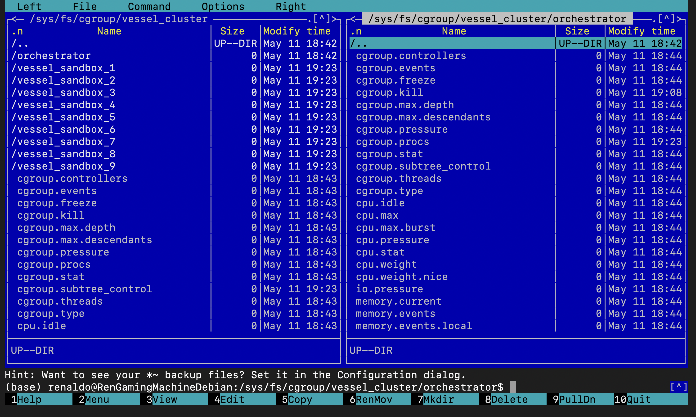
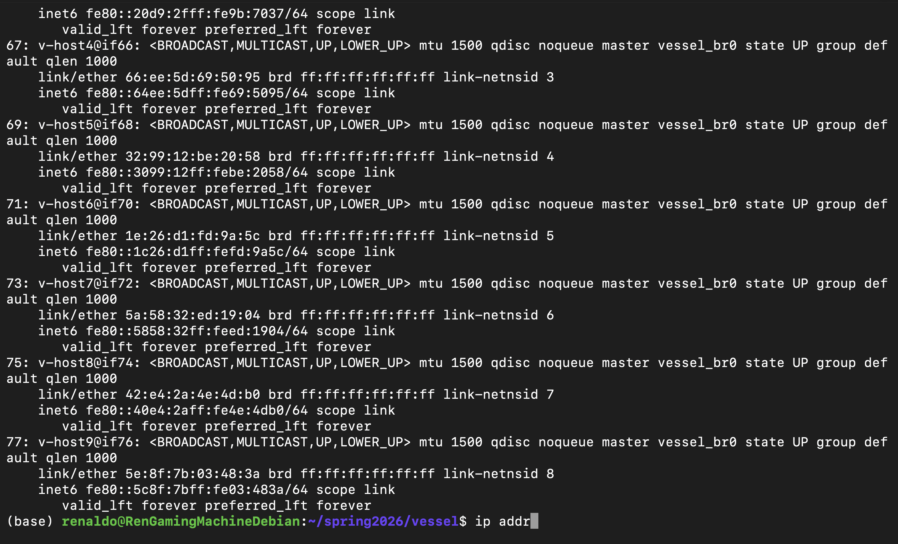
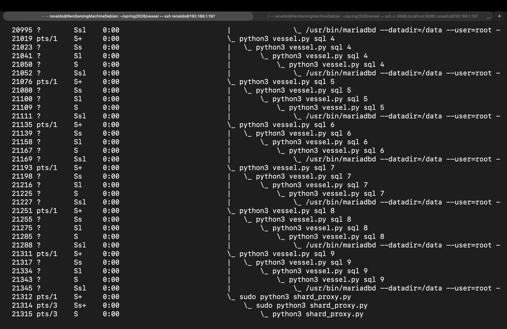

# Vessel
A minimal Linux container engine designed to demonstrate the fundamentals of OS-level virtualization.
<details>
<summary><b>View Photo 1: Resource Caging & Host Handshake</b></summary>



The initial execution phase anchors the engine to the hardware. Before the Python supervisor boots, the shell wrapper carves out a sanctuary in the Cgroup v2 unified hierarchy.

**Key Detail:** Notice the cpu.stat dump. This confirms the kernel is actively tracking execution microseconds and enforcing the 100000 / 100000 quota (100% of a single core).
</details>

<details>
<summary><b>View Photo 2: Namespace Mapping & Identity</b></summary>



By inspecting the kernel status of the process tasks, we can verify the physical separation of the container's identity from the host.

**Key Detail:** The NSpid 7 entry shows the kernel has re-indexed the background telemetry thread to a local ID of 7, independent of its actual PID on the host. This confirms the PID namespace is active, allowing us to target this specific thread for telemetry interrupts without conflict, while ensuring the container remains strictly isolated from the host's global process table.
</details>

<details>
<summary><b>View Photo 3: Asynchronous Telemetry & IPC</b></summary>



The final architectural pillar is the Asynchronous Heartbeat. This demonstrates a persistent, non-blocking telemetry channel that survives the execvp payload swap.

**Key Detail:** The Ghost Processes count of 2 reveals the invisible host anchors (the Manager and Bridge) that are still technically part of this cgroup, providing a 360-degree view of the sandbox's resource footprint.
</details>


## Overview
Vessel bypasses high-level abstractions like Docker or containerd to interface directly with the Linux kernel. It constructs isolated environments using raw system calls, kernel namespaces, and control groups. This project serves as a bare-metal implementation of a container runtime, proving that containers are simply a specific configuration of native Linux security features rather than standalone virtual machines.

## Core Architecture and Execution Flow
The engine relies on a physically separated build-and-run architecture, utilizing distinct Linux kernel mechanisms spread across four primary components to establish an impenetrable container boundary with real-time telemetry.

1. Build-Phase Software Injection `provisionLinux.py`
This script acts as the infrastructure compiler. It provisions an Alpine Linux Mini Root Filesystem, dynamically mirrors the host machine's DNS routing configuration, and handles the compilation and injection of external software directly into the static filesystem image before runtime isolation occurs.
2. Resource Caging & Initialization `vessel-launcher.sh`
This shell script serves as the resource manager and execution entry point. It interfaces directly with the host kernel's Cgroup v2 pseudo-filesystem to construct the sandbox environment. It performs legacy state cleanup, applies strict hardware ceilings for CPU time slices, and securely locks its own process into the cgroup tree before handing execution over to the Python engine.
3. Triple-Fork Isolation & Supervisor Pattern  `vessel.py`
The runtime engine utilizes a synchronized multi-fork pattern to transition from the host environment into the isolated container without mutating the original caller. The Master Process forks a namespace manager to protect the host terminal. The Middle Child executes the unshare system call with namespace flags to sever kernel relationships. Finally, the Grandchild crosses the boundary to become PID 1, mounts the private filesystems, and forks one last time. This final fork separates the persistent Python Supervisor from the ephemeral interactive shell payload.

4. Asynchronous Telemetry & Kernel IPC `telemetryTask.py`
A native POSIX thread is spawned directly into the container's PID 1 memory space using ctypes and NPTL, operating independently of the Python Global Interpreter Lock. This watcher thread applies a kernel-level signal mask and enters a zero-CPU wait state using sigwait. Upon trapping a SIGUSR1 hardware interrupt from the host, it dynamically resolves its Cgroup v2 location via procfs and dumps real-time memory and CPU telemetry directly to the container's standard output.


• The Manager Process: Forks a supervisor and waits for its completion. This ensures the host's terminal state is preserved and the main script remains a "clean" host citizen.

• The Namespace Supervisor (Middle Child): Executes the unshare system call with CLONE_NEWNS, CLONE_NEWPID, and CLONE_NEWNET flags. It marks the root filesystem as private (--make-rprivate) to prevent mount leaks back to the host.

• The Container Init (Grandchild): Crossed the PID namespace boundary to become PID 1. It performs the final chroot into the provisioned rootfs, mounts a private /proc pseudo-filesystem, and executes the login shell. This process remains the sole owner of the terminal's stdin until exit.

## Prerequisites
Executing this engine requires a native Linux environment or a lightweight hypervisor. It cannot be executed natively on macOS or Windows due to its reliance on Linux-specific system calls. Absolute root privileges (sudo) are mandatory to interact with the kernel namespace and cgroup subsystems.
### Quick Start
1.	Clone this repository to your Linux host environment.
2.	Execute `sudo python3 provisionLinux.py` to download the core filesystem, mirror the host DNS, compile Vim, and prepare the static container image at /tmp/vessel-root.
3.	Launch the runtime engine by executing the resource wrapper via `sudo ./vessel-launcher.sh`.
4.	Verify your isolation by running ```ps x``` inside the spawned login shell to confirm your supervisor is operating as PID 1 and your shell as a child payload.
5.	Test the asynchronous kernel IPC by opening a second host terminal, locating the supervisor's host PID using ```ps -ef | grep vessel.py```, and executing `sudo kill -10 [PID]`.
6.	Return to your container terminal to observe the real-time Cgroup v2 telemetry dump triggered by the host interrupt.

### Optional Fun
7.   [Connect to the internet](vethernet.md) by bridging the container's isolated network namespace to the host using a veth pair on a private shared subnet, and routing the outbound traffic through the host's kernel via Network Address Translation masquerading
