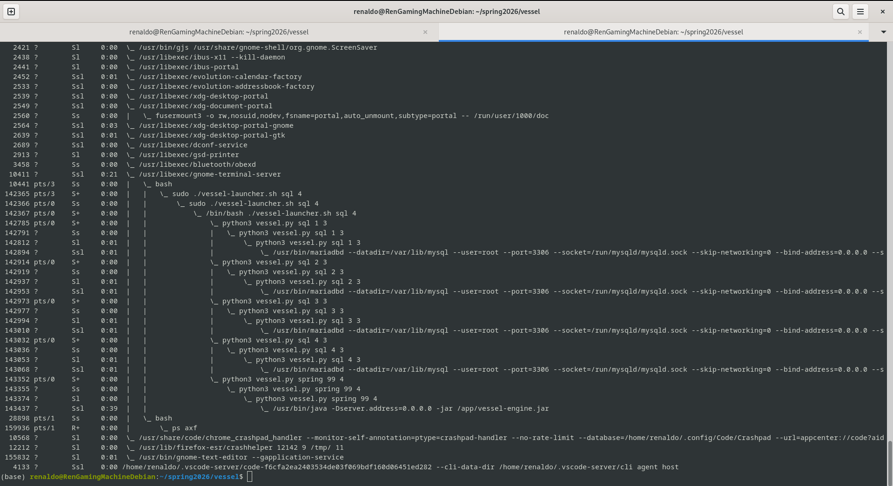
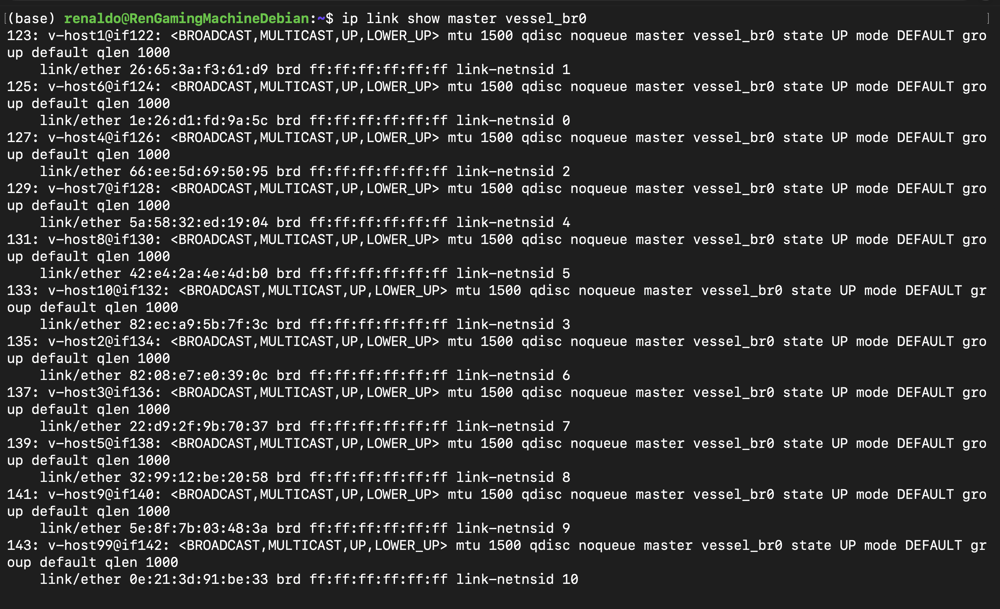
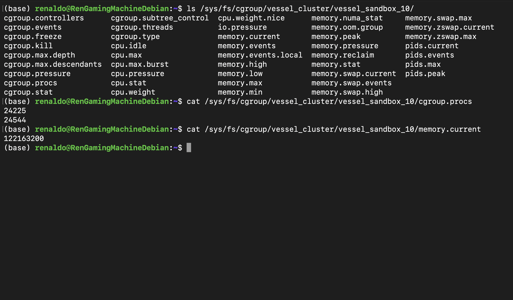
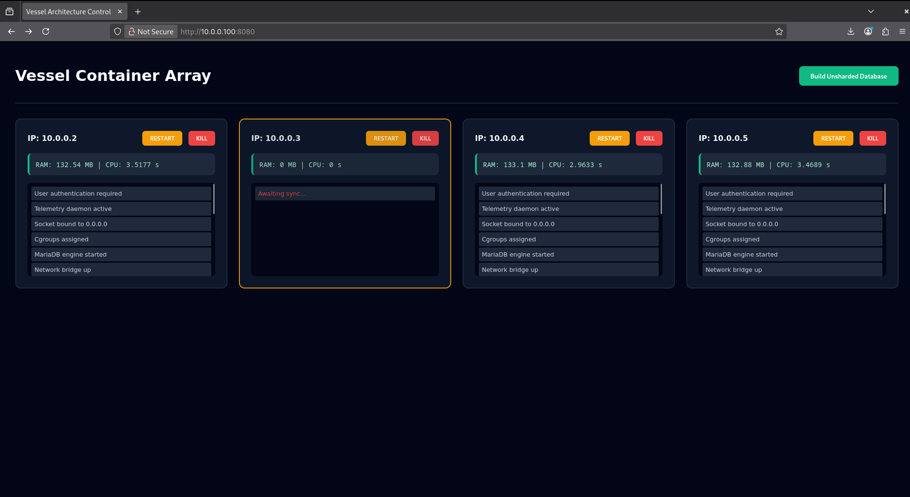

# Vessel: A Bare-Metal Linux Container Engine

Vessel is a high-performance, lightweight container runtime engineered from the ground up using raw Linux system calls. By bypassing high-level abstractions like Docker, Vessel interfaces directly with the kernel to provide isolated execution environments. It is designed for developers who require granular control over system processes, filesystem isolation, and horizontal database scaling.

## Technical Architecture Overview

Vessel operates at the intersection of process orchestration and kernel-level resource management. The engine leverages the Linux kernel's most robust security and isolation primitives.

### Kernel-Level Isolations (The "Vessel Boundary")
**Vessel constructs an impenetrable cage for each shard using:**

| Primitive| Purpose |
| -------- | -------- | 
| PID Namespace| Ensures the containerized database operates as PID 1, unaware of host processes. | 
| Mount Namespace | Provides a private filesystem view via Alpine Linux rootfs, preventing access to the host host OS. |
| Network Namespace | Creates a virtualized network stack, isolating the container's ports from the host network.|
| Cgroup v2 | Enforces hard limits on CPU time slices and memory consumption, preventing resource starvation.|
| veth Pairs/Bridge | Connects isolated namespaces via a software bridge to the host's 10.0.0.0/24 subnet.|
| PTY Virtualization | Bridges master/slave pseudoterminals to provide interactive shell support without leaking state to `/dev` |

---

### Union Filesystem Architecture (OverlayFS)

Vessel abandons inefficient full-directory copies in favor of OverlayFS. This copy-on-write (CoW) architecture layers a writable directory on top of a read-only directory, creating a unified virtual view for the process inside the namespace while saving massive amounts of disk space.

1. **The Lower Directory (`/tmp/vessel-root-base`):** This is the immutable foundation. It contains the heavy OS binaries, the Java runtime, the Spring Boot JAR, and the MariaDB installation. All container shards share this exact same physical disk space.
2. **The Upper Directory (`/tmp/vessel-upper_X`):** This is the unique, isolated scratchpad for each individual shard. Whenever a container attempts to create a new file, modify an existing file, or write to the database, those changes are written exclusively into this directory on the host machine.
3. **The Work Directory (`/tmp/vessel-work_X`):** An empty, hidden staging area required by the Linux kernel. Before the kernel commits a file to the Upper directory, it writes it here first to guarantee atomic operations and prevent corruption during crashes.
4. **The Merged Directory (`/tmp/vessel-root_X`):** The optical illusion exposed to the container. It is a virtual mount point where the kernel stacks the Upper layer on top of the Lower layer. When the container looks at `/`, it sees this merged view.

### Validating the OverlayFS Isolation

To prove the copy-on-write mechanics are functioning, you can perform three specific hardware-level validation tests using the interactive shell mode (`sudo ./vessel-launcher.sh shell`):

1. **File Creation Isolation:** Create a file at the container root (`echo "Hello" > /secret.txt`). On the host machine, verify that `cat /tmp/vessel-root-base/secret.txt` fails, while `cat /tmp/vessel-upper_1/secret.txt` succeeds.
2. **Copy-on-Write (CoW) Validation:** Append text to an existing base system file (`echo "127.0.0.1 custom" >> /etc/hosts`). On the host, verify the base layer file (`/tmp/vessel-root-base/etc/hosts`) remains untouched, while a brand new, modified copy appears in the upper layer (`/tmp/vessel-upper_1/etc/hosts`).
3. **The Whiteout Deletion Test:** Delete a base file from within the container (`rm /etc/hostname`). On the host, run `ls -la /tmp/vessel-upper_1/etc/hostname`. You will observe a character device file with major/minor numbers of `0,0`. This "whiteout" file instructs the Merged layer to pretend the underlying base file no longer exists.

---

## The Control Plane: Spring Boot Integration
The orchestration layer is augmented by a Spring Boot-based Control Plane. This backend service serves the interactive Dashboard and acts as a resilient proxy for all database sharding operations.

1. **Serving the UI:** The DashboardController serves the interactive HTML interface, providing real-time cluster visualization.
2. **Proxy Logic:** By abstracting the JDBC connections, the Spring engine allows for unified data aggregation (the "Unshard" functionality) across independently sharded MariaDB instances.
3. **Resilience:** The backend implements auto-healing JdbcTemplate caches, which dynamically discard dead connections to terminated containers and recreate them upon node recovery.

## Component Deep Dive

The execution phase begins by establishing a unified hardware sanctuary for the entire architecture. Before any individual shard boots, the orchestrator script constructs a master cluster within the Cgroup v2 hierarchy and enables subtree delegation.

**Key Detail:** By locking the main deployment loop into the parent cgroup, every spawned sandbox inherits absolute CPU and memory limits. This kernel-level kill switch allows the host to cleanly terminate the entire database cluster simultaneously without leaving rogue orphan processes.

Scaling from a single container to a sharded cluster requires a robust routing topology. Vessel abandons simple crossover cables for a centralized software bridge operating natively at Layer 2.

**Key Detail:** The virtual switch architecture assigns the primary gateway directly to the bridge interface. This ensures all database shards reside on the same `10.0.0.0/24` subnet, enabling native cross-container communication and frictionless proxy routing.

The system uses a precise sequence of isolated cloning to cross the namespace boundary without collapsing host orchestration:

1. **Host Manager:** Root execution, provisions the cgroup cage.
2. **Bridge:** Spawned via first `fork()`, executes unshare to carve out namespaces.
3. **PID 1 Supervisor:** Spawned via second `fork()`, configures internal IP and mounts proc.
4. **The Payload:** Spawned via final `execvp()`, runs the target MariaDB binary with dropped privileges.

The Node Health Dashboard aggregates live hardware metrics from isolated Cgroup v2 filesystems.

**Key Detail:** A native POSIX thread sits in a zero-CPU wait state inside the container's PID 1 namespace. When the host issues a `SIGUSR1` interrupt, this thread reads kernel cgroup data, ensuring observability without impacting database performance.

# Deployment and Configuration

## Prerequisites

1. **Operating System:** Native Linux (Kernel 5.x+).
2. **Dependencies:** `Python3`, `pymysql`, `OpenJDK 21`.
3. **Privileges:** Absolute root (`sudo`) is required for namespace, mount, and cgroup manipulation.

## Quick Start

1. **Prepare Environment:** Clone the repository and ensure your JDK 21 path is available.
2. **Build Backend:** Use the provided Maven wrapper to compile the management engine:
   `./mvnw clean package -DskipTests`
   `cp vessel-engine/target/vessel-engine-0.0.1-SNAPSHOT.jar /app/vessel-engine.jar`
3. **Configure Startup:** Vessel uses `vessel.py` to launch shards. Ensure your startup script uses `shutil.which("java")` for dynamic path resolution to prevent `FileNotFoundError`.
4. **Prevent Conflicts:** Ensure your `VesselEngineApplication` includes `@SpringBootApplication(exclude = {DataSourceAutoConfiguration.class})` to prevent conflict with the `DashboardController`.

## Running the Engine

1. **Interactive Mode:** `sudo ./vessel-launcher.sh shell 1`
2. **Production SQL Mode:** `sudo ./vessel-launcher.sh sql [shardCount]`

| Endpoint | Method | Description |
| -------- | -------- | -------- | 
| `/api/cluster-state` | GET | Returns telemetry, record count, and health status for all shards.| 
| `/api/unshard` | GET | Aggregates data from all shards into a single unified SQL view. |
| `/api/kill` | POST | Triggers `SIGTERM` on target shard (requires confirmation) and prevents supervisor restart.| 
| `/api/restart` | POST | Gracefully restarts the database payload on the target shard via the supervisor loop. |

## Troubleshooting Guide

1. **"No database selected" errors:** Ensure your queries use fully qualified table names (e.g., `appdata.cluster_data`). The engine is designed to lazily initialize the schema, so this ensures operations succeed regardless of session state.
2. **Startup Hangs:** The engine uses a dynamic `java_bin` path lookup. If the system cannot find Java, verify the `JAVA_HOME` environment variable inside your launch script.
3. **Dashboard Stale Data:** The dashboard utilizes a cache-busting timestamp (`?t=Date.now()`) in the fetch API. If you see stale status (Red/Orange), check the `DashboardController` logs for `JdbcTemplate` initialization failures.

    In conclusion, this project stands as a testament to the fact that containerization is NOT a proprietary magic trick, but an arrangement of native Linux kernel features. This project was built to strip away the abstractions of high-level container runtimes, forcing us to interface directly with the kernel's process scheduler, bridge networking, and resource caging APIs.

    The following visual guide provides a 'bare-metal' inspection of the engine. These captures demonstrate that the boundaries of our shards are not merely logical, but physical constraints enforced by the kernel itself. Explore the anatomy of our triple-fork lifecycle, the network bridge topology, and the resource caging that holds the architecture together.

    
 
        
Process Anatomy: The Triple-Fork Hierarchy

        
        
This section documents the execution boundary of the kernel-level virtualization. By inspecting the kernel's process tree, you can visually trace the isolation strategy.

        
<strong>Screenshot Guidance:</strong> Run <code>ps axf</code> or <code>pstree -p</code> on the host machine. Capture the output that shows the Python Host Manager branching into the Bridge, then the Supervisor acting as PID 1 inside the sandbox, and finally the database payload as the child process.

    

        
Network Topology: Layer 2 Bridge & Subnet

        
        
Scaling requires a robust routing topology. Vessel abandons simple network translation for a centralized software bridge operating natively at Layer 2.

        
<strong>Screenshot Guidance:</strong> Run <code>ip addr show</code> or <code>brctl show</code> on the host. Capture the bridge interface that reveals all database shards residing on the same 10.0.0.0/24 subnet, proving native cross-container communication.

    

        
Resource Caging: Cgroup v2 Isolation

        
        
Vessel enforces strict resource ceilings by locking the container lifecycle into a specific cgroup delegate. This ensures memory and CPU pressure remains contained within the sandbox.

        
<strong>Screenshot Guidance:</strong> Capture a view of the <code>/sys/fs/cgroup/</code> directory path for one of your active containers. Display the file contents of <code>memory.max</code> and <code>cpu.max</code> to provide tangible proof of the hardware ceilings you have enforced.

    

        
Observability: Real-Time Telemetry Dashboard

        
        
The Node Health Dashboard aggregates live hardware metrics from isolated cgroup filesystems. This centralized interface provides immediate visibility into container memory consumption and data equilibrium.

        
<strong>Screenshot Guidance:</strong> Provide a clean capture of your browser dashboard while a shard is in the "Restarting" state. This highlights the UI integration with your custom telemetry threads and confirms that the dashboard is successfully polling the container side-channels.

    

